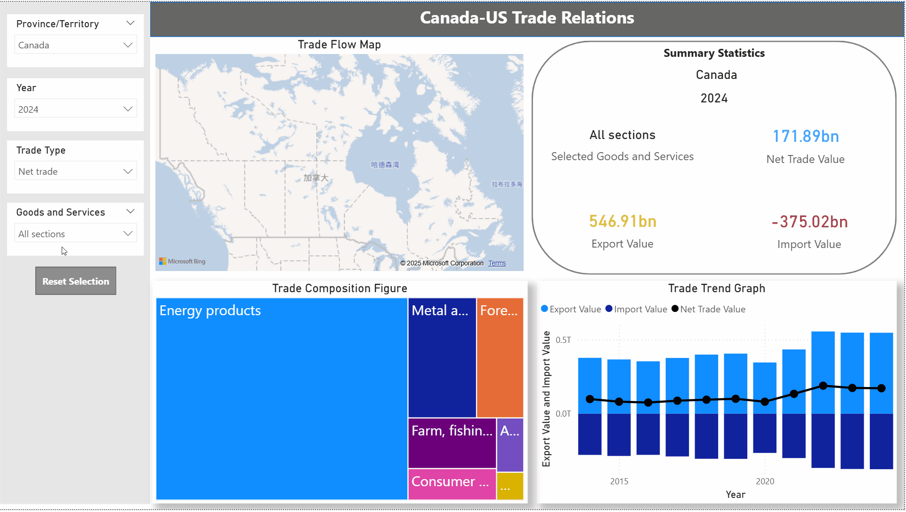

# Canada Trade Dashboard (Power BI)

This Power BI dashboard explores Canadian imports and exports by **province**, **year**, and **goods/services**, from 2014–2024. It includes interactive features like:

- **Dynamic slicers** for Province, Year, Goods Type, and Trade Type
- A filled map of Canada with hover tooltips
- Custom cards showing **net trade values** with color-coding

## Preview

## Files
- `trade.pbix`: Power BI file
- `trade.pdf`: Exported PDF version
- `demo.jif`: Gif demo of the dashboard

## Tools Used
- Power BI Desktop
- DAX for custom measures

## Key Insights
- [✓] Alberta and Ontario lead in total exports
- [✓] Net trade surplus peaked in 2022
- [✓] Top exports include crude oil and vehicles

## 📄 License
This project is for educational and demonstration purposes only.
